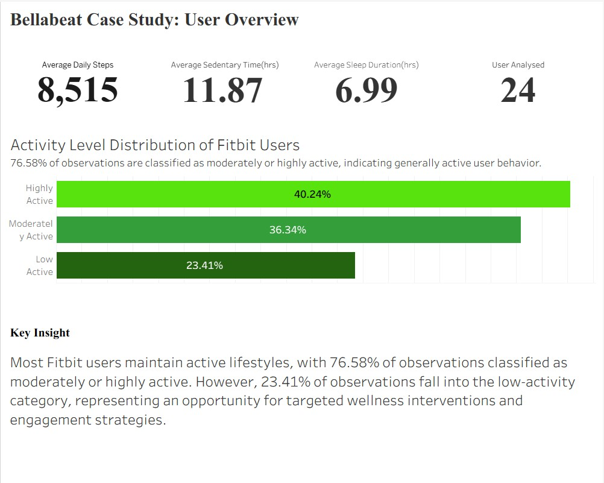
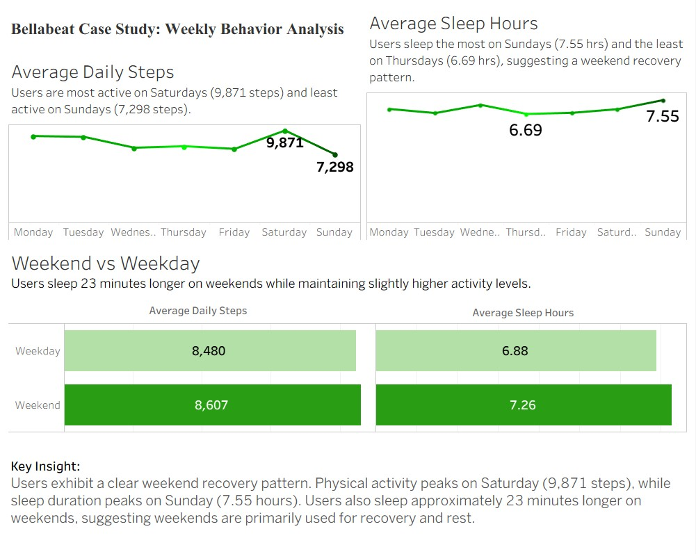
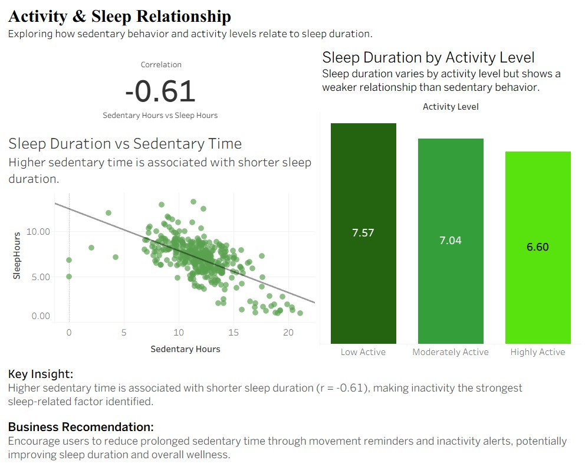

# Bellabeat_casestudy

## Project Overview

This project analyzes Fitbit fitness tracker data to identify trends in user activity, sleep behavior, and sedentary habits. The objective is to generate actionable insights that can support Bellabeat's marketing strategy and product development decisions.

The project follows the complete data analysis process including data cleaning, transformation, exploratory data analysis, dashboard development, and business recommendations.

## Business Task

Analyze smart-device usage data to identify user behavior trends and determine how these insights can help Bellabeat improve user engagement and support healthier lifestyles.

## Tools Used

- Python
- Pandas
- NumPy
- Matplotlib
- Seaborn
- Tableau
- Jupyter Notebook

- ## Key Findings

- 76.58% of observations were classified as moderately active or highly active.
- Users averaged 8,515 daily steps.
- Average sleep duration was 6.99 hours per night.
- Users displayed a clear weekend recovery pattern, with sleep duration peaking on Sundays.
- Sedentary behavior showed the strongest relationship with sleep duration (r = -0.61).

## Recommendations

1. Reduce sedentary behavior through inactivity alerts and movement reminders.
2. Increase engagement among low-activity users through personalized challenges and goal-setting features.
3. Leverage weekend recovery patterns by providing sleep and wellness insights during weekends.

## Project Deliverables

- Final Report (PDF)
- Tableau Dashboards
- PowerPoint Presentation
- Jupyter Notebook Analysis

## Dashboard Preview

### Dashboard 1 - User Overview

### Dashboard 2 - Weekly Behavior Analysis

### Dashboard 3 - Activity & Sleep Relationship

## Repository Contents

- Bellabeat_Analysis.ipynb
- 01_finalreport.pdf
- Bellabeat_Presentation.pptx
- Dashboard1_User_Overview.png
- Dashboard2_Weekly_Behavior_Analysis.png
- Dashboard3_Activity_Sleep_Relationship.png 
